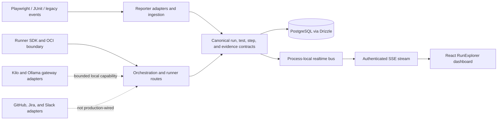

<div align="center">
  <h1>Automate</h1>
  <p><strong>A local-first control plane for test evidence, run intelligence, and isolated automation.</strong></p>
  <p>
    <a href="https://nodejs.org/"></a>
    <a href="https://pnpm.io/"></a>
    <a href="https://www.typescriptlang.org/"></a>
    <a href="LICENSE"></a>
  </p>
</div>

> **Current maturity: local/sample implementation.** The canonical reporter → reporting → dashboard vertical slice is implemented and tested. Production OCI execution, production publication, credential rotation, and destructive data migration are intentionally not enabled yet.

Automate is the active unified repository for **Q-Ace**, a planned QA automation control plane. It normalizes test results into shared contracts, persists run evidence, exposes live updates, and provides a React dashboard for exploring runs, analytics, quarantine, and quality gates.

The longer-term product adds independently deployable runners, AI-provider gateways, connectors, and isolated execution for browser, API, load, security, and mobile tools. Those boundaries are being built, but they are not all production-ready today. The authoritative status is [`docs/migration/capability-register.md`](docs/migration/capability-register.md).

## Why Automate?

QA teams commonly stitch together reporters, CI logs, dashboards, spreadsheets, and separate execution tools. Automate focuses on the evidence and control layer between them:

- **One canonical result model** for Playwright, JUnit, legacy reporters, and future producers.
- **Run-centric analytics** with duration, status, trends, quarantine, and quality-gate policies.
- **Live run updates** over authenticated Server-Sent Events (SSE).
- **Revocable installation sessions** with HttpOnly cookies and installation-scoped credentials.
- **Clear runner boundaries** so customer automation code never executes inside the dashboard process.
- **Evidence before claims** — mock behavior is documented as mock, not presented as production parity.

## Current vertical slice



| Capability                     | Current state                                                                                             |
| ------------------------------ | --------------------------------------------------------------------------------------------------------- |
| Reporter ingestion             | **Implemented** — canonical, versioned, and legacy events; Playwright JSON and JUnit upload               |
| Run persistence                | **Implemented** — Drizzle/PostgreSQL with an explicit in-memory development fallback                      |
| RunExplorer and dashboard APIs | **Implemented** — run detail, tests, suites, analytics, quarantine, and quality gates                     |
| Realtime                       | **Partial** — versioned SSE and replay boundary exist; API composition currently uses a process-local bus |
| Authentication                 | **Partial** — revocable sessions and Drizzle storage exist; multi-instance and retention evidence remain  |
| Runner and orchestration       | **Boundary only** — SDK, state machine, leases, and OCI files exist; production execution is not proven   |
| AI and connectors              | **Boundary only** — provider/connector adapters exist without durable, provider-backed product flows      |
| Deployment                     | **Local only** — loopback Compose assets exist; there is no approved production topology                  |

## Quick start

### Prerequisites

- Node.js `22.19.x`
- pnpm `10.30.2`
- Docker Engine is optional and only required for the Compose workflow

Install the workspace:

```bash
pnpm install --frozen-lockfile
```

### Run the zero-database sample

The web development proxy expects the API on port `3456`. Start the API and web app in separate terminals so their ports and credentials stay aligned.

**Terminal 1 — API (PowerShell)**

```powershell
$env:PORT='3456'
$env:NODE_ENV='development'
$env:AUTOMATE_API_KEY='local-installation-key'
$env:COOKIE_SECRET='local-cookie-secret-change-me-32-chars'
$env:REPORTER_SECRET='local-reporter-secret-change-me'
pnpm --filter @automate/api dev
```

**Terminal 1 — API (macOS/Linux)**

```bash
PORT=3456 \
NODE_ENV=development \
AUTOMATE_API_KEY=local-installation-key \
COOKIE_SECRET=local-cookie-secret-change-me-32-chars \
REPORTER_SECRET=local-reporter-secret-change-me \
pnpm --filter @automate/api dev
```

**Terminal 2 — Web**

```bash
pnpm --filter @automate/unified-web dev
```

Then:

1. Open `http://localhost:5173`.
2. Sign in with `local-installation-key`.
3. Verify the API at `http://localhost:3456/api/v1/health`.

This mode intentionally uses in-memory run and dashboard state. Restarting the API clears it.

### Run the local Compose stack

The Compose topology adds PostgreSQL, MinIO, API, web, and an edge proxy.

**PowerShell**

```powershell
$env:REHEARSAL_MODE='local'
docker compose -f infra/compose/compose.dev.yml build
docker compose -f infra/compose/compose.dev.yml up -d
```

**macOS/Linux**

```bash
REHEARSAL_MODE=local docker compose -f infra/compose/compose.dev.yml build
REHEARSAL_MODE=local docker compose -f infra/compose/compose.dev.yml up -d
```

| Surface          | Address                  |
| ---------------- | ------------------------ |
| Edge application | `http://127.0.0.1:58080` |
| Web direct       | `http://127.0.0.1:53173` |
| API direct       | `http://127.0.0.1:53000` |
| PostgreSQL       | `127.0.0.1:55432`        |
| MinIO API        | `http://127.0.0.1:59000` |
| MinIO console    | `http://127.0.0.1:59001` |

The compose file uses `pull_policy: never`; the external images must be available locally. See [`docs/deployment.md`](docs/deployment.md) for shutdown, volume cleanup, and deployment boundaries.

## Configuration

The API validates `process.env` through [`packages/config`](packages/config). The workspace scripts do not load `.env` files automatically, so provide variables through your shell, process manager, or the Compose stack.

| Variable                           |    Required | Purpose                                                      |
| ---------------------------------- | ----------: | ------------------------------------------------------------ |
| `NODE_ENV`                         |  Production | Enables production startup policy                            |
| `HOST`, `PORT`                     |          No | API bind address; defaults to `127.0.0.1:3000`               |
| `PUBLIC_APP_URL`                   |  Production | Public web origin used for secure-cookie policy              |
| `DATABASE_URL`                     |  Production | PostgreSQL connection used by Drizzle                        |
| `COOKIE_SECRET`                    |  Production | Session-token hashing and cookie integrity                   |
| `VAULT_SECRET`                     |  Production | Versioned vault encryption secret                            |
| `AUTOMATE_API_KEY`                 | Recommended | Installation bootstrap and API-key authentication            |
| `REPORTER_SECRET`                  | Recommended | Authentication for reporter event ingestion                  |
| `WORKSPACE_ID`                     |          No | Explicit workspace boundary; defaults to `default-workspace` |
| `KILO_GATEWAY_URL`, `KILO_API_KEY` |          No | Kilo Gateway adapter; the key is required with the URL       |
| `OLLAMA_BASE_URL`                  |          No | Direct local Ollama adapter                                  |
| `SESSION_TTL_HOURS`                |          No | Session lifetime; defaults to `24`                           |
| `AUDIT_RETENTION_DAYS`             |          No | Audit retention policy; defaults to `365`                    |

Use [`.env.example`](.env.example) as the variable inventory. Never commit real secrets.

## Repository map

| Path                                              | Responsibility                                                                                          |
| ------------------------------------------------- | ------------------------------------------------------------------------------------------------------- |
| `apps/api`                                        | Hono control-plane API, ingestion, reporting, auth, dashboard, orchestration, and runner routes         |
| `apps/web`                                        | React 19 dashboard, TanStack Router routes, run explorer, analytics, quarantine, and quality-gate views |
| `apps/runner`                                     | Independently deployable runner process boundary                                                        |
| `packages/shared-contracts`                       | Canonical Zod schemas for reporting, realtime, orchestration, sessions, and runner traffic              |
| `packages/reporter`                               | Producer adapters and normalized reporter protocols                                                     |
| `packages/reporting`                              | Framework-independent evidence, KPI, and quality-gate policies                                          |
| `packages/realtime`                               | Versioned event envelopes, replay, and transport boundaries                                             |
| `packages/orchestration`                          | Automation inventory, schedules, jobs, state transitions, and retry policy                              |
| `packages/automation`                             | Kilo and Ollama gateway ports/adapters                                                                  |
| `packages/runner-sdk`                             | Runner identity, heartbeat, job, lease, and event protocol                                              |
| `packages/auth`, `packages/config`, `packages/db` | Identity/session rules, typed configuration, Drizzle schema, and migrations                             |
| `packages/connectors`                             | GitHub, Jira, and Slack connector SDKs                                                                  |
| `runners`                                         | Pinned OCI execution definitions for future tool workloads                                              |
| `tools/migrate-cli`                               | Deterministic migration planning, rehearsal, and reconciliation primitives                              |
| `tests`, `e2e`                                    | Contract, integration, vertical-slice, and browser tests                                                |
| `infra`                                           | Local Compose, Docker, nginx, and deployment assets                                                     |
| `docs`                                            | Architecture, migration evidence, deployment, provider, API, and database guidance                      |

## Common commands

All commands run from the repository root.

| Command                  | Purpose                                                                     |
| ------------------------ | --------------------------------------------------------------------------- |
| `pnpm dev`               | Start API and web with the variables already present in the environment     |
| `pnpm build`             | Build every workspace package and app                                       |
| `pnpm test`              | Run the Vitest unit/integration suites                                      |
| `pnpm typecheck`         | Run strict TypeScript checks                                                |
| `pnpm lint`              | Run ESLint with zero warnings allowed                                       |
| `pnpm verify`            | Run the full build, test, typecheck, and lint gate                          |
| `pnpm test:contract`     | Validate canonical and compatibility contracts                              |
| `pnpm test:integration`  | Run repository integration tests                                            |
| `pnpm test:e2e`          | Run the Playwright suite with managed API/web servers                       |
| `pnpm test:e2e:vertical` | Run the authenticated reporter → reporting → SSE vertical slice             |
| `pnpm security:verify`   | Run the local dependency, secret, and policy checks                         |
| `pnpm unify:preflight`   | Enforce repository boundaries and prevent legacy/generated-file regressions |
| `pnpm db:check`          | Validate the Drizzle migration graph                                        |
| `pnpm db:generate`       | Generate a forward migration after schema changes                           |

`pnpm migrate:apply` remains intentionally blocked for destructive writes until resumable waves, native backups, and restore verification are enabled.

## API surface

All versioned application endpoints are under `/api/v1`.

| Route family                                 | Purpose                                                    |
| -------------------------------------------- | ---------------------------------------------------------- |
| `GET /api/v1/health`                         | Liveness endpoint                                          |
| `POST /api/v1/auth/*`                        | Login, session inspection, and logout                      |
| `POST /api/v1/reporter/events`               | Versioned and legacy reporter event ingestion              |
| `POST /api/v1/reporter/results`              | Canonical result ingestion and duplicate/conflict handling |
| `POST /api/v1/reporter/upload`               | Playwright JSON or JUnit XML upload                        |
| `GET /api/v1/reporting/*`                    | Canonical run results and KPI projections                  |
| `GET /api/v1/runs`                           | Persisted run listing                                      |
| `GET /api/v1/dashboard/*`                    | Run explorer, analytics, quarantine, and quality gates     |
| `GET /api/v1/events`                         | Authenticated `text/event-stream` for `run:updated` events |
| `/api/v1/runner/v1/*`                        | Runner enrollment, synchronization, and event batches      |
| `/api/v1/automations`, `/schedules`, `/jobs` | Orchestration boundary                                     |

Reporter events use their own `REPORTER_SECRET`. Control-plane routes require an installation API key or a valid session cookie. Runner routes use runner-specific credentials.

## Testing and CI

The repository treats tests as part of the capability contract:

- Vitest 4 powers unit and integration coverage with package-level thresholds.
- Playwright owns the API/browser vertical slice and product E2E suite.
- Root Turborepo tasks enforce dependency and coverage boundaries.
- `.github/workflows/unified-ci.yml` runs formatting, lint, typecheck, tests, security checks, migration checks, E2E, and builds.
- Release-gate and nightly workflows cover the broader migration and platform checks.

Run the local gate before opening a pull request:

```bash
pnpm verify
pnpm test:e2e
pnpm security:verify
```

## Security and production boundaries

- Production startup requires `DATABASE_URL`, `COOKIE_SECRET`, and `VAULT_SECRET`.
- Session cookies are HttpOnly, SameSite=Lax, and Secure when the public origin uses HTTPS.
- Reporter payloads and uploaded paths are validated and bounded before persistence.
- Secrets belong in a secret manager or local environment, never in Git.
- Migration apply and production cutover fail closed until their explicit gates are satisfied.
- OCI images must be built, digest-pinned, and independently verified before they can be considered deployable.
- This repository does not currently claim production readiness, multi-instance SSE durability, or a production secret-rotation procedure.

## Documentation

| Document                                                                            | Use it for                                                                             |
| ----------------------------------------------------------------------------------- | -------------------------------------------------------------------------------------- |
| [`Capability register`](docs/migration/capability-register.md)                      | The current source of truth for what is real, partial, missing, deferred, or obsolete  |
| [`Migration decision record`](docs/migration/phase-0-decision-record.md)            | Scope, evidence, approvals, and implementation status                                  |
| [`Unified migration specification`](docs/migration/unified-repository-migration.md) | Target architecture, data model, runtime topology, and migration rules                 |
| [`Architecture ADR`](docs/architecture/unified-platform.md)                         | Original architecture proposal; superseded where the migration decision record differs |
| [`Deployment`](docs/deployment.md)                                                  | Local Compose topology and release boundary                                            |
| [`AI provider support matrix`](docs/ai-provider-support-matrix.md)                  | Kilo/Ollama capability and routing decisions                                           |
| [`Reporter API route`](apps/api/src/routes/reporter.ts)                             | Versioned, legacy, canonical, and upload endpoint behavior                             |
| [`Shared contracts`](packages/shared-contracts/src)                                 | Canonical reporting, realtime, orchestration, session, and runner schemas              |
| [`Drizzle migrations`](packages/db/drizzle)                                         | PostgreSQL migration graph and schema history                                          |
| [`Parity matrix`](docs/parity-matrix.md)                                            | Capability-by-capability migration evidence                                            |
| [`Changelog`](CHANGELOG.md)                                                         | Current unified implementation summary                                                 |
| [`AGENTS.md`](AGENTS.md)                                                            | Repository-specific engineering and validation rules                                   |

## Contributing

1. Branch from `main` and keep changes focused.
2. Add or update executable evidence for every behavior change.
3. Run `pnpm verify` and the relevant E2E suite.
4. Use Conventional Commit subjects enforced by the root tooling.
5. Do not weaken tests, delete failing cases, or describe mock behavior as production-ready.

## License

[MIT](LICENSE) © 2026 Automate Platform Contributors
