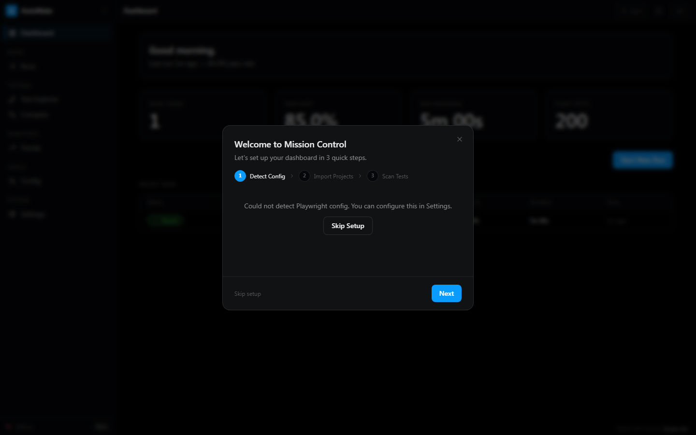
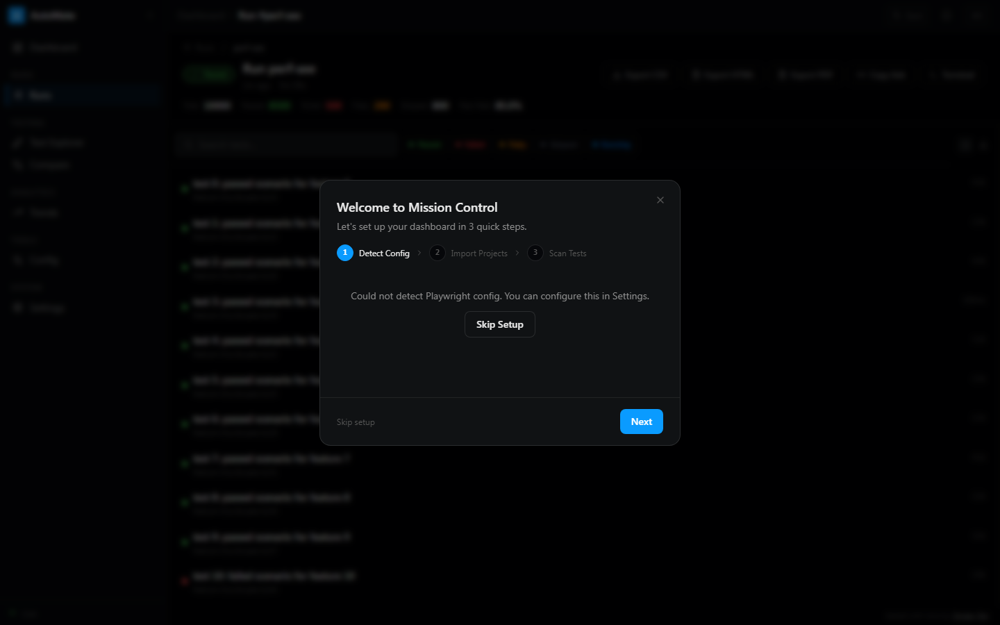
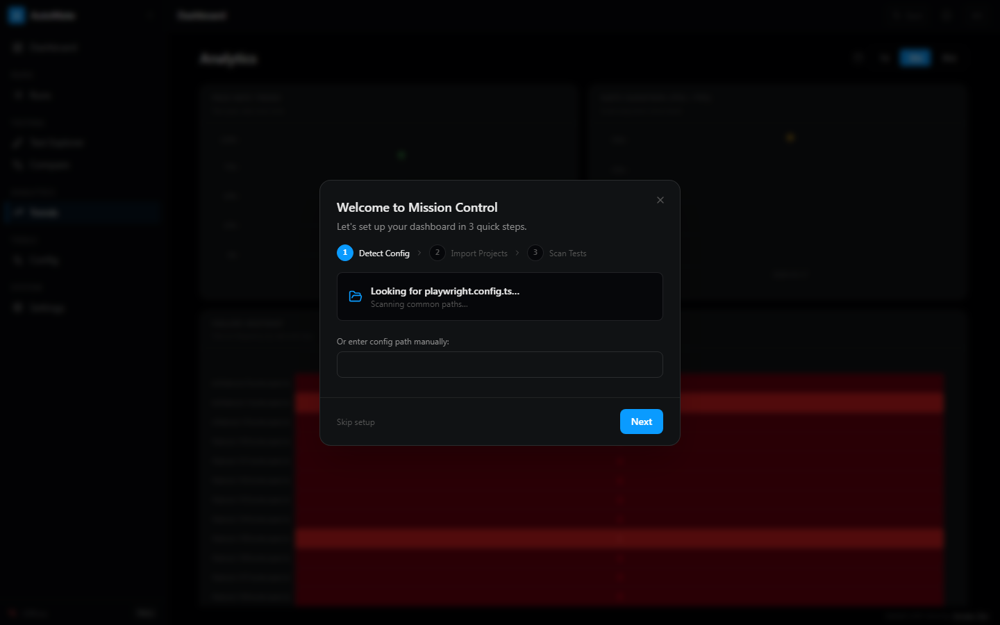

<p align="center">
  <h1 align="center">Automate</h1>
  <p align="center">
    MVP-first, self-hosted Playwright dashboard for live runs, failure triage, artifacts, and quality gates.
  </p>
  <p align="center">
    <a href="LICENSE"></a>
    <a href="https://www.npmjs.com/package/@automate/reporter"></a>
    <a href="https://ghcr.io/automate-hq/automate"></a>
    <a href=".nvmrc"></a>
    <a href="tsconfig.base.json"></a>
  </p>
</p>

<p align="center">
  <!-- screenshot: docs/assets/screenshot-dashboard.png -->
  
</p>

---

## Why Automate?

- **MVP-first.** The default product promise is one flow: connect Playwright, stream a run, inspect failures, and gate CI.
- **Zero infrastructure.** SQLite and a single binary. No Postgres, no Redis, no separate services to manage.
- **Playwright-native.** A custom WebSocket reporter streams results as tests run. Not a generic test tool bolted onto Playwright.
- **Self-hosted.** Your test data, artifacts, and credentials stay on your infrastructure. No SaaS lock-in, no per-seat pricing.
- **Real-time, always.** The dashboard updates live via WebSocket. No polling, no page refreshes.

---

## Quick Start

```bash
docker run -d \
  -p 4000:4000 \
  -p 4001:4001 \
  -v automate_dashboard_data:/app/apps/server/data \
  -v automate_dashboard_artifacts:/app/apps/server/test-results \
  -e AUTOMATE_DASHBOARD_API_KEY=your-secret-key \
  ghcr.io/automate-hq/automate:latest
```

Open [http://localhost:4000](http://localhost:4000) and enter your API key.

### Connect Your Tests

Install the reporter:

```bash
npm install -D @automate/reporter
```

Add it to `playwright.config.ts`:

```typescript
import { defineConfig } from '@playwright/test';

export default defineConfig({
  reporter: [
    ['list'],
    ['@automate/reporter'],
  ],
});
```

Run your tests:

```bash
AUTOMATE_DASHBOARD_URL=ws://localhost:4001 npx playwright test
```

Results stream to the dashboard in real-time.

---

## MVP Scope

The MVP is intentionally narrow: help a QA or engineering team understand a failing Playwright run in minutes, without sending test data to a SaaS service.

### MVP user flow

1. Start the dashboard with Docker or `pnpm dev`.
2. Add `@automate/reporter` to `playwright.config.ts`.
3. Run Playwright locally or in CI.
4. Watch the run stream live.
5. Open failed tests, screenshots, videos, traces, and timing details.
6. Use pass-rate analytics and quality gates to decide whether the build can ship.

### MVP features

| Feature | Description |
|---|---|
| **Live Monitoring** | Watch tests execute in real-time via WebSocket |
| **Failure Analysis** | Screenshot diffs, video playback, trace viewer, step timeline |
| **Analytics Essentials** | Pass-rate trends, duration charts, and recent run health |
| **Test Explorer** | Groupable tree view with search and filters |
| **Quality Gates** | Pass-rate thresholds for CI/CD pipelines |
| **Auth** | API key login with signed `httpOnly` session cookies |
| **i18n** | English and Hebrew with full RTL support |

### Post-MVP / opt-in features

The repository already contains deeper capabilities, but they are not part of the MVP promise and are disabled by default: AI Explain, Auto-Quarantine, NL Query, Codegen Launcher, Terminal Runner, Scheduled Runs, Baseline Management, Error Clustering, Run Comparison, Integrations, MCP features, enterprise gates, SSO/RBAC, and AI test generation. Enable them explicitly with feature flags when validating a design partner use case.

---

## Screenshots

<p align="center">
  
</p>

<p align="center">
  
</p>

<p align="center">
  
</p>
---

## Architecture

Automate is a pnpm monorepo with a two-port design: port 4000 serves the REST API, browser WebSocket, and the SPA; port 4001 accepts incoming WebSocket connections from the Playwright reporter.

```
automate/
├── apps/
│   ├── server/       # Fastify 5 + Drizzle ORM + SQLite
│   └── client/       # React 19 + Vite 7 + TanStack Router
├── packages/
│   ├── shared/       # Zod schemas shared between client and server
│   ├── reporter/     # Playwright WebSocket reporter (published to npm)
│   └── cli/          # @automate/cli — zero-question setup
├── docs-site/        # Starlight documentation site
└── docs/             # Assets and internal references
```

---

## Docker Deployment

The `docker-compose.yml` includes an optional nginx reverse-proxy profile.

```bash
# Start the app (direct port access)
docker compose up -d

# Start with nginx on port 80
docker compose --profile nginx up -d

# Stop (data is preserved in named volumes)
docker compose down

# Stop and wipe all data
docker compose down -v
```

The `automate_dashboard_data` volume holds the SQLite database. The `automate_dashboard_artifacts` volume stores screenshots, videos, and traces. Both persist across container restarts.

---

## Environment Variables

| Variable | Default | Description |
|---|---|---|
| `PORT` | `4000` | HTTP server and browser WebSocket port |
| `REPORTER_PORT` | `4001` | Reporter WebSocket ingestion port |
| `HOST` | `0.0.0.0` | Server bind address |
| `NODE_ENV` | `development` | Runtime mode (`development` or `production`) |
| `CORS_ORIGIN` | `*` | Allowed CORS origins — restrict in production |
| `DATA_DIR` | `./data` | SQLite database directory |
| `ARTIFACTS_DIR` | `./test-results` | Test artifact storage directory |
| `AUTOMATE_DASHBOARD_URL` | `ws://localhost:4001` | WebSocket URL used by the reporter |
| `AUTOMATE_DASHBOARD_API_KEY` | — | Required. Dashboard login key |
| `PUBLIC_DASHBOARD_URL` | — | Public URL for notification links (Slack, GitHub) |
| `SENTRY_DSN` | — | Sentry DSN — leave blank to disable |
| `LOG_LEVEL` | `info` | Log level (`debug`, `info`, `warn`, `error`) |

### Feature Flags

The default install exposes only the MVP surface. Post-MVP capabilities are opt-in: set the corresponding env var to `true` while validating a specific design partner workflow.

**MVP features (on by default):**

```bash
FEATURE_LIVE_RUN_MONITORING=true
FEATURE_TEST_EXPLORER=true
FEATURE_ANALYTICS_DASHBOARD=true
FEATURE_ARTIFACT_VIEWERS=true
FEATURE_QUALITY_GATE=true
```

**Post-MVP workflow features (off by default):**

```bash
FEATURE_AI_EXPLAIN=true          # Enable AI failure explanations
FEATURE_NL_QUERY=true            # Enable natural-language search
FEATURE_SCHEDULED_RUNS=true      # Enable cron-based scheduling
FEATURE_CODEGEN_LAUNCHER=true    # Enable Playwright codegen launcher
FEATURE_TERMINAL_RUNNER=true     # Enable integrated terminal runner
FEATURE_AUTO_QUARANTINE=true     # Enable automatic flaky quarantine
FEATURE_BASELINE_MANAGEMENT=true # Enable screenshot baseline management
FEATURE_ERROR_CLUSTERING=true    # Enable grouped failure signatures
FEATURE_RUN_COMPARISON=true      # Enable side-by-side run diffs
FEATURE_INTEGRATION_HOOKS=true   # Enable Slack/Jira/GitHub notifications
```

**Post-MVP intelligence and enterprise features (off by default):**

```bash
FEATURE_FAILURE_TAXONOMY=true
FEATURE_PREDICTIVE_TEST_SELECTION=true
FEATURE_SCREENSHOT_DIFF=true
FEATURE_LOOKS_SAME_DIFF=true
FEATURE_CROSS_RUN_CLUSTERS=true
FEATURE_RISK_SCORING=true
FEATURE_AUDIT_TRAIL=true
FEATURE_PER_WORKSPACE_GATES=true
FEATURE_QUARANTINE_APPROVAL=true
FEATURE_ROI_METRICS=true
FEATURE_LOCATOR_INTELLIGENCE=true
FEATURE_TEST_GENERATION=true
FEATURE_MCP_SERVER=true
FEATURE_MCP_GATEWAY=true
FEATURE_RBAC=true
FEATURE_SSO=true
```

---

## Development

```bash
git clone https://github.com/automate-hq/automate.git
cd automate

pnpm install

# Copy and configure environment
cp .env.example .env

# Push the database schema
pnpm --filter @automate/dashboard-server run db:push

# Start dev servers (client :5173, server :4000)
pnpm dev
```

```bash
# Run server tests (724 tests)
pnpm --filter @automate/dashboard-server test

# Run client tests (641 tests)
pnpm --filter @automate/dashboard-client test

# Type-check all packages
pnpm typecheck

# Lint
pnpm lint
```

---

## Documentation

Full documentation is available at the docs site:

- [Getting Started](docs-site/src/content/docs/getting-started.md)
- [Deployment Guide](docs-site/src/content/docs/deployment.md)
- [Configuration](docs-site/src/content/docs/configuration.md)
- [API Reference](docs-site/src/content/docs/api.md)
- [Architecture](docs-site/src/content/docs/architecture.md)

---

## Contributing

See [CONTRIBUTING.md](CONTRIBUTING.md) for setup instructions, code conventions, and the pull request process.

---

## License

[MIT](LICENSE)
