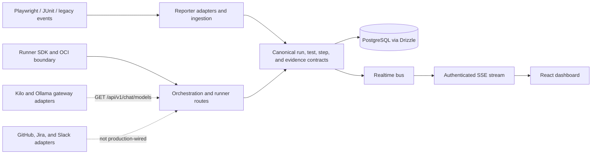

# Architecture

## The contracts are the centre

`packages/shared-contracts` holds the canonical Zod schemas for a run, a test, a
step, and evidence. Every producer, every store, and every reader agrees on those
shapes, which is the only reason a Playwright JSON upload, a JUnit upload, and a
legacy reporter event can appear in one dashboard and be compared.

Three properties are load-bearing and each has cost something to learn:

- **One spelling per state.** `tests.status` once accepted both `timedOut` and
  `timed_out`, and nothing failed — an aggregation simply split one state in two.
- **One version per event.** Every event carries a version, and the SSE stream
  replays by sequence, so a client can resume without gaps.
- **One derived pair.** A run's `phase` and `outcome` are derived together, never
  taken independently. Writing them separately made a CHECK constraint
  unreachable by a client choice and surfaced as a 500 for a merely malformed
  request.

## Persistence

Drizzle against PostgreSQL, with an explicit in-memory fallback for development
rather than an implicit one. Migrations are a journal-ordered graph; `pnpm
migrate:plan` reads the repository and never a database, and `pnpm db:check` fails
when the journal and the schema disagree.

The tenancy boundary is `WORKSPACE_ID`, and it is applied to the tables it was
extended to — vault entries, connector credentials, schedules, outbox events, the
chat tables. A boundary applied to some tables and not others is not a boundary,
which is why each of those is its own migration.

## Realtime

`packages/realtime` owns the versioned envelope and the replay boundary. The
production composition root currently uses a process-local bus; the durable
outbox-backed feed exists and is exercised by tests. That gap is recorded on the
[Capabilities](/pages/capabilities) page rather than described as working.

## The runner boundary

`packages/runner-sdk` is the protocol a runner speaks: enroll, heartbeat, claim,
complete. Leases and fencing tokens are enforced in
`apps/api/src/execution/drizzle-execution-store.ts`, and every write is bounded by
the lease it was claimed under.

The client in `apps/runner/src/client.ts` is the only one the runner binary uses.
A second HTTP client for the same protocol once lived in `packages/runner-sdk`
along with its own passing test suite, imported by nothing — which is the shape
that lets a protocol change land in one and silently miss the other.
`pnpm docs:dead-exports` now fails on an export with no consumer.

## The model gateway

`packages/automation` declares a two-method port, `listModels` and
`streamCompletion`, and two adapters. `apps/api/src/routes/chat.ts` depends on the
**port**, not on a provider: which gateway serves a request is decided at the
composition root from configuration, so the route knows nothing about Kilo or Ollama
and a test supplies a stub without reaching a network.

A chat stream that breaks mid-flight says so with an explicit `error` frame rather
than stopping without a `done` one — on the wire those are the same bytes, and a
client that could not tell them apart would render a half-read answer as a complete
one. For a product whose claim is evidence, that distinction is the feature.

## Testing

Vitest for units and integration, Playwright for the browser and product E2E. The
route manifest is machine-checked: a route registered but absent from the canonical
list is a failure, so the client and the server cannot disagree about what exists.

Coverage is gated by a **ratchet**, not by per-package thresholds. Four packages sit
below the thresholds `vitest.shared.ts` states, and a gate that blocks every run gets
raised until it means nothing. The ratchet fails on a regression, so a floor can only
move up.
